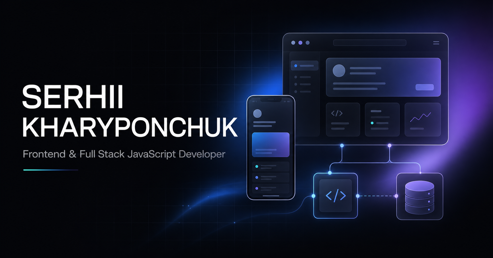

# Serhii Kharyponchuk — Developer Portfolio



A premium personal portfolio for Serhii Kharyponchuk, a Frontend and Full Stack
JavaScript Developer based in the Netherlands.

The site presents real projects, technical capabilities, a verified frontend
certificate, GitHub activity, and direct contact information through a fast,
responsive, and accessible interface.

## Highlights

- Responsive design for desktop, tablet, and mobile
- Dark and light themes with persisted preferences
- Framer Motion section transitions and reduced-motion support
- Animated background, subtle particles, scroll progress, and desktop cursor
- Real project screenshots optimized as WebP
- Lazy-loaded project and certificate media
- Fullscreen certificate viewer with zoom controls
- Semantic HTML and keyboard-accessible interactions
- Open Graph, X card, JSON-LD, sitemap, robots.txt, and custom favicon
- Server-rendered production output for fast initial delivery

## Featured Work

| Project | Description | Links |
| --- | --- | --- |
| Waves Arcade | Full-stack browser game with accounts, progression, leaderboards, administration tools, analytics, and secure score validation. | [Repository](https://github.com/SerhiiKharyponcuk/waves-arcade) · [Live](https://waves-arcade.vercel.app/) |
| Undying Metro Shop | Responsive gaming community and shop interface focused on visual hierarchy and performance. | [Live](https://serhiikharyponcuk.github.io/undying-metro-shop/) |
| IP Information Website | Animated browser utility that presents device, operating system, browser, and IP-related information. | Portfolio preview |
| Yacht Adventures | Responsive yacht rental website created as a team project. | [Live](https://serhiikharyponcuk.github.io/yacht-adventures-team-project/) |
| Britlex | Responsive language-learning landing page created as a team project. | [Live](https://serhiikharyponcuk.github.io/britlex-team-project/) |

## Technology

### Frontend

- React 19
- TypeScript
- JavaScript
- HTML5 and CSS3
- Tailwind CSS toolchain
- Framer Motion
- Lucide React

### Runtime and build

- Vite
- vinext
- Next-compatible App Router
- Cloudflare Workers-compatible output

### Quality

- ESLint
- Node.js test runner
- Server-rendered HTML assertions
- Production build verification

## Getting Started

### Prerequisites

- Node.js `>=22.13.0`
- npm

### Installation

```bash
git clone https://github.com/SerhiiKharyponcuk/developer-portfolio.git
cd developer-portfolio
npm install
```

### Development

```bash
npm run dev
```

### Production build

```bash
npm run build
```

### Validation

```bash
npm run lint
npm test
```

`npm test` creates a production build and verifies the server-rendered portfolio
content and metadata.

## Project Structure

```text
app/
  components/        Interactive portfolio and certificate components
  globals.css        Design system, responsive layout, themes, and motion
  layout.tsx         SEO metadata and structured data
  page.tsx           Main route
  robots.ts          Search crawler policy
  sitemap.ts         Sitemap generation
public/
  certificates/      Optimized certificate media
  projects/          Optimized project screenshots
  favicon.svg        Custom site icon
  og.png             Social sharing image
tests/
  rendered-html.test.mjs
worker/              Cloudflare Worker entrypoint
```

## Performance and Accessibility

- Images use intrinsic dimensions and responsive sizing to prevent layout shift.
- Project and certificate assets are compressed and loaded lazily.
- Motion is implemented with transform and opacity where possible.
- `prefers-reduced-motion` is respected.
- Theme, modal, navigation, buttons, forms, and media controls include accessible
  labels and keyboard behavior.
- The custom desktop cursor activates only when a fine pointer and JavaScript
  support are available.

## Deployment

The portfolio is published from the `gh-pages` branch:

**[serhiikharyponcuk.github.io/developer-portfolio](https://serhiikharyponcuk.github.io/developer-portfolio/)**

`npm run build:pages` creates the static GitHub Pages version. The regular
`npm run build` command keeps the Cloudflare Workers-compatible vinext build
available for other deployment targets.

## Contact

- GitHub: [@SerhiiKharyponcuk](https://github.com/SerhiiKharyponcuk)
- Email: [kharyponchuksergej@gmail.com](mailto:kharyponchuksergej@gmail.com)
